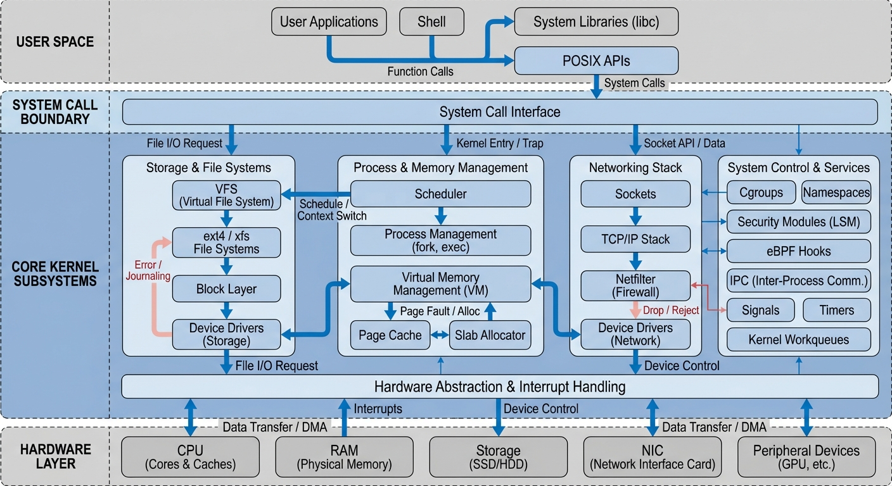
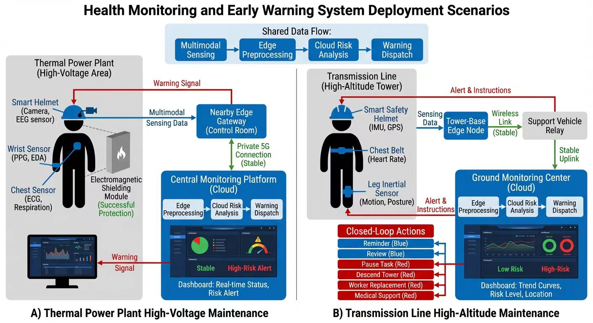

# Engineering Figure Banana

[中文说明](./README.zh-CN.md) | [English Guide](./README.en.md)

Engineering Figure Banana is not a general-purpose academic figure platform. It is an agent-native skill for engineering and CS paper figures, designed to split conceptual diagrams and exact quantitative plots into different workflows.

`engineering-figure-banana` 不是一个通用配图平台，而是一个面向 agent 工作流的工程论文配图 skill，专门把概念图和精确定量图分开处理。

## Why This Skill

- Agent-native: designed for Codex and research-agent workflows instead of a standalone paper-upload product
- Two-mode workflow: `image mode` for conceptual diagrams, `plot mode` for exact publication plots
- Engineering-first: optimized for CS, systems, algorithms, electronics, and embedded-paper visuals
- Publication-aware: prioritizes white backgrounds, readable labels, compact palettes, and export-ready figures

## Example Gallery

These examples are placed near the top so visitors can judge the visual direction immediately.

| Example | Description |
| --- | --- |
|  | High-density autonomous-driving overview redesigned from a reference-inspired concept using the high-resolution path |
|  | Modern cooperative perception and tracking pipeline with a newly organized layout |
|  | Taxonomy-style multi-agent safety overview restructured into a new hierarchy for showcase use |
|  | Dense systems overview example for engineering-style architecture composition |
|  | Supplementary user-provided reference example showing dense deployment-scenario composition for health monitoring and safety warning systems |

See [docs/examples/README.md](docs/examples/README.md) for example notes and source references.

## Support Matrix

| Platform | Status | Notes |
| --- | --- | --- |
| Windows | tested | primary tested platform, helper scripts supported first |
| macOS | reported working | successful installs have already been reported, including AI-assisted setup |
| Linux | expected to work for core Python workflow | some environments may still need small manual adjustments |

## Positioning

This project is intentionally lighter than a full platform:

- It does not center on uploading full papers into a web app
- It does center on controllable figure production inside an existing research workflow
- It does separate conceptual figures from exact plots instead of treating every figure as the same prompt problem
- It is designed for people who already know what figure they need and want a cleaner production path

Recommended upstream handoff:

1. Use `ai-research-writing-guide` to decide what claim the figure should support
2. Use `engineering-figure-banana` to render the final diagram or plot

## Two Modes

### `image mode`

Best for:

- system architecture diagrams
- algorithm workflows
- graphical abstracts
- electronics or embedded-system schematics
- reference-inspired redraws and layout exploration

Use this when visual structure matters more than exact numeric geometry.

### `plot mode`

Best for:

- benchmark bar charts
- ablation plots
- trend curves
- heatmaps
- scatter plots
- multi-panel quantitative figures

Use this when values, axes, and geometric fidelity must stay exact.

Rule of thumb:

- if numeric truth matters, use `plot mode`
- if the figure is conceptual, use `image mode`
- if a figure mixes both, render the quantitative panels locally first and keep image generation for the explanatory panels

## Repository Guides

- [README.zh-CN.md](./README.zh-CN.md): Chinese overview, setup, examples, and messaging
- [README.en.md](./README.en.md): English overview, setup, examples, and positioning
- [SKILL.md](./SKILL.md): internal Codex skill instructions
- [providers.md](./providers.md): provider-neutral API configuration notes
- [docs/examples/README.md](./docs/examples/README.md): showcase notes

For installation-friendly details, start with:

- `README.zh-CN.md` -> `Windows 最短安装路径` / `安装后如何验证 skill 已被 Codex 识别`
- `README.en.md` -> `Shortest Windows Install Path` / `How To Verify Codex Recognizes The Skill`
- `README.zh-CN.md` -> `可选上游 skill：ai-research-writing-guide`
- `README.en.md` -> `Optional Upstream Skill: ai-research-writing-guide`
- `README.zh-CN.md` -> `Platform Support` / `macOS / Linux Setup Notes`
- `README.en.md` -> `Platform Support` / `macOS / Linux Setup Notes`

## Quick Start

```powershell
& "$HOME/.codex/skills/engineering-figure-banana/scripts/install_and_test.ps1" -RunSetupCheck
```

Then either:

```powershell
& "$HOME/.codex/skills/engineering-figure-banana/scripts/wizard.ps1"
```

or run a direct prompt test:

```powershell
python "$HOME/.codex/skills/engineering-figure-banana/scripts/generate_image.py" `
  --figure-template system-architecture `
  --lang en `
  "A retrieval-augmented generation system with OCR, chunking, embedding, vector search, reranking, and answer synthesis."
```

## Project Summary

Engineering Figure Banana is an agent-native figure workflow for engineering and CS papers. It handles conceptual diagrams and exact publication plots with separate pipelines instead of treating paper figures as a single generic image-generation task.

## Notes

- Keep real API keys outside the repository
- Prefer local plotting for exact quantitative figures
- Keep provider-specific private relay details out of public docs unless they are clearly marked as optional examples
