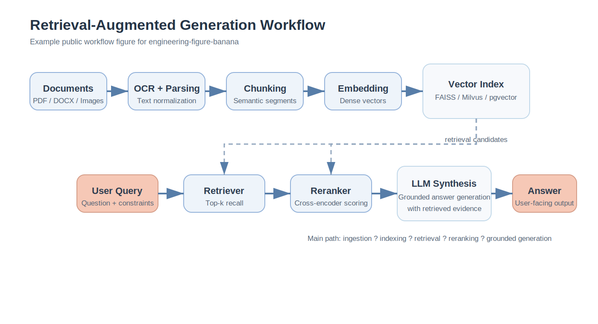
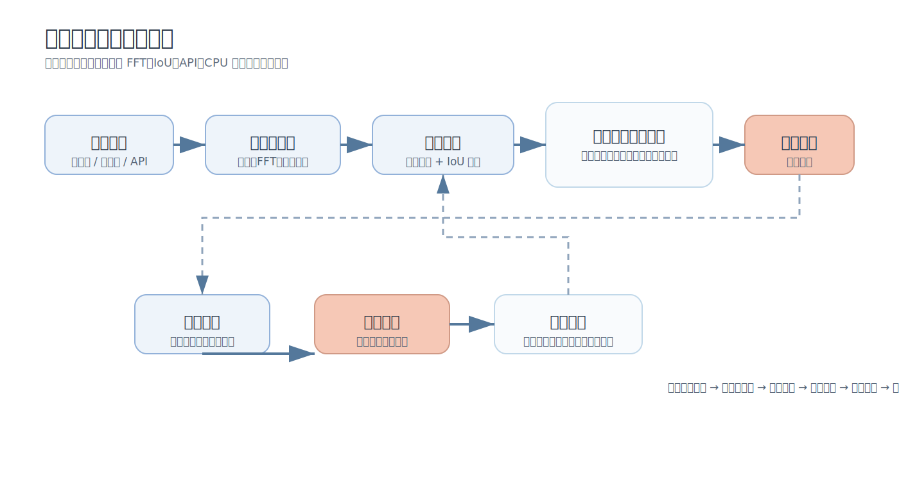
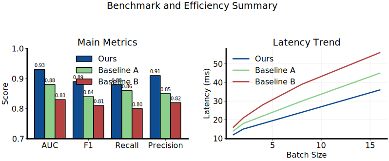

# Engineering Figure Banana

A Codex-native skill for generating engineering paper figures inside academic workflows. It focuses on computer science, electronics, algorithms, embedded systems, and publication-style benchmark plots.

## Token Safety / No Silent Fallback

If you explicitly ask for `pro-2k`, `2K`, high-resolution, or final-export quality, this project is expected to protect your token budget instead of silently downgrading behind your back.

- High-resolution requests should use the configured high-resolution path, not an unannounced lower-tier substitute
- If the high-resolution path fails because of missing config, rate limiting, timeout, network trouble, or upstream errors, generation should stop intentionally
- The workflow must not silently fall back to a cheaper or lower-tier model, because that can waste tokens and produce the wrong quality tier
- After a high-resolution failure, the correct next step is to ask the human whether to retry high-resolution generation or explicitly allow fallback

## What This Project Is

This repository is designed for:

- system architecture diagrams
- algorithm workflows
- electronics and embedded-system schematics
- graphical abstracts for engineering or AI methods
- benchmark charts, ablation plots, heatmaps, scatter plots, and other publication figures

It is intentionally optimized for:

- Codex-centered workflows rather than a standalone web app
- engineering and CS papers rather than broad all-discipline academic illustration
- Chinese and English technical papers
- both conceptual figures and exact quantitative plots
- provider-neutral Gemini-compatible backends

## 5-Minute Quick Start

1. Copy or clone this repository into `$HOME/.codex/skills/engineering-figure-banana`
2. Copy the env and key templates into `$HOME/.codex/secrets/` and fill in your provider values
3. Run:
   - `& "$HOME/.codex/skills/engineering-figure-banana/scripts/install_and_test.ps1"`
   - then `& "$HOME/.codex/skills/engineering-figure-banana/scripts/wizard.ps1"` or the minimal command below

Fastest Windows path:

```powershell
& "$HOME/.codex/skills/engineering-figure-banana/scripts/install_and_test.ps1" -RunSetupCheck
```

## Recommended Workflow

This project works best as a two-stage paper-figure workflow:

1. Use `ai-research-writing-guide` to decide what the figure should prove, which figure type is best, what panels or modules are required, and what caption logic should be preserved.
2. Use `engineering-figure-banana` to turn that figure brief into an actual diagram or plot.

Recommended handoff fields:

- figure goal
- figure type
- core modules or panel plan
- must-keep terms, variables, and abbreviations
- output language
- caption idea or message
- visual constraints

One-line workflow example:

```text
First use ai-research-writing-guide to produce a figure brief from my paper section, then use engineering-figure-banana to generate the final figure. Keep the figure publication-style, preserve standard English symbols, and do not silently downgrade if high-res generation fails.
```

## Repository Layout

- `SKILL.md` - internal skill instructions for Codex
- `agents/openai.yaml` - skill metadata for discovery
- `scripts/` - installation, setup checks, wizard, prompt builders, generation, and plotting tools
- `references/` - engineering templates and publication-style references
- `examples/figure-briefs/` - reusable figure brief templates
- `docs/examples/` - repository-safe showcase outputs and their source prompts or requests
- `providers.md` - provider-neutral compatibility notes
- `secrets/nanobanana.env.example` - copyable local env template

## Prerequisites / Requirements

- Python 3.10 or newer is recommended
- Codex skill runtime is required if you want this repository to be discovered and invoked as a Codex skill
- Node.js is optional; `scripts/generate_image.js` exists for users who prefer the JavaScript path
- PowerShell is recommended on Windows for loading secrets, setup checks, and the wizard

Install Python dependencies with:

```powershell
pip install -r requirements.txt
```

## Modes

The skill supports two working modes:

- `image mode`
  - Best for conceptual figures such as system architecture diagrams, algorithm workflows, graphical abstracts, and electronics schematics
  - Use this when visual structure matters more than exact numeric geometry
- `plot mode`
  - Best for benchmark charts, ablation plots, heatmaps, scatter plots, trend curves, and other quantitative publication figures
  - Use this when exact values, axes, and geometric fidelity matter

Rule of thumb:

- If numeric truth matters, use `plot mode`
- If the figure is conceptual or schematic, use `image mode`
- If a figure mixes both, keep the quantitative panels in `plot mode` and use `image mode` only for the explanatory panels

## Install and First Run

### 1) Copy the skill

Put this repository at:

- `$HOME/.codex/skills/engineering-figure-banana`

### 2) Configure local secrets

Create these local files outside the repo:

- `$HOME/.codex/secrets/nanobanana.env`
- `$HOME/.codex/secrets/nanobanana_api_key.txt`

You can start from:

- `secrets/nanobanana.env.example`
- `secrets/nanobanana_api_key.txt.example`

Official Google example:

```env
NANOBANANA_BASE_URL=https://generativelanguage.googleapis.com
NANOBANANA_DEFAULT_MODEL=gemini-3.1-flash-image-preview
NANOBANANA_HIGHRES_MODEL=gemini-3.1-flash-image-preview
NANOBANANA_AUTH_MODE=google
```

Third-party relay example:

```env
NANOBANANA_BASE_URL=https://your-relay.example.com
NANOBANANA_DEFAULT_MODEL=<your-default-image-model>
NANOBANANA_HIGHRES_MODEL=<your-highres-image-model>
NANOBANANA_AUTH_MODE=bearer
NANOBANANA_ALLOW_THIRD_PARTY=1
```

The API key file should contain only your current valid key on one line.

### 3) Run setup check

```powershell
& "$HOME/.codex/skills/engineering-figure-banana/scripts/check_setup.ps1"
```

### 4) Load local env

```powershell
. "$HOME/.codex/skills/engineering-figure-banana/scripts/load_nanobanana_env.ps1"
```

### 5) Run a minimal image test

```powershell
python "$HOME/.codex/skills/engineering-figure-banana/scripts/generate_image.py" `
  --figure-template system-architecture `
  --lang en `
  "A retrieval-augmented generation system with OCR, chunking, embedding, vector search, reranking, and answer synthesis."
```

### 6) Or use the wizard

```powershell
& "$HOME/.codex/skills/engineering-figure-banana/scripts/wizard.ps1"
```

## Chinese Paper Support

This repository is intentionally friendly to Chinese engineering papers rather than treating Chinese labels as an afterthought.

- If `--lang` is omitted, Chinese technical background defaults to Chinese figure labels
- Chinese labels can be generated directly in the figure and should be kept concise and readable
- Standard English symbols, abbreviations, protocol names, model names, and formula variables should be preserved where they improve technical clarity
- The workflow is designed for Chinese and English mixed academic writing rather than forcing awkward full-Chinese replacements for terms like `FFT`, `CNN`, `IoU`, `loss`, or variables like `x`, `y`, `t`, and `sigma`

Good Chinese-figure prompt habits:

- use concise Chinese labels
- keep larger text regions and balanced spacing when the figure has many labels
- preserve English abbreviations and formula variables when they are standard notation
- keep the figure readable at single-column paper width

## Provider Compatibility

This skill is provider-neutral, but the official Google Gemini endpoint is still the reference configuration for public docs.

| Provider type | Base URL pattern | Auth mode | Need `NANOBANANA_ALLOW_THIRD_PARTY` | High-res config | Notes |
| --- | --- | --- | --- | --- | --- |
| Official Google Gemini | `https://generativelanguage.googleapis.com` | `google` | No | Optional `NANOBANANA_HIGHRES_MODEL` | Recommended public reference pattern |
| Gemini-compatible relay | provider-specific | `bearer` or provider-specific | Usually yes | Usually provider-specific | Replace example endpoint and model names with your own values |
| Custom internal provider | internal endpoint | provider-specific | Usually yes | provider-specific | Validate data handling and API compatibility first |

For more detail, see `providers.md`.

## Example Outputs / Screenshots

These examples are repository-safe and meant to show the visual direction of the project without exposing private paper material.

### Preview Wall

| Example | Mode | Description |
| --- | --- | --- |
|  | `image` | Detailed English system architecture overview |
|  | `image` | Clean workflow figure for an AI pipeline |
|  | `image` | Chinese engineering figure with preserved English technical terms |
|  | `plot` | Quantitative publication figure rendered locally |

See `docs/examples/README.md` for the source prompt or request file behind each example.

## Figure Brief Templates

If you are not sure how to write a good prompt, start from `examples/figure-briefs/`.

Included starter briefs:

- `system-architecture-en.md`
- `system-architecture-zh.md`
- `algorithm-workflow-en.md`
- `engineering-pipeline-zh.md`
- `benchmark-plot-request.md`

These are designed to bridge the planning step from `ai-research-writing-guide` into the production step in this skill.

## Troubleshooting

### `nanobanana_api_key.txt` not found

- Make sure the file exists at `$HOME/.codex/secrets/nanobanana_api_key.txt`
- If you set `NANOBANANA_API_KEY_FILE`, make sure it points to a real file on the current machine
- If you migrated from another computer, remove stale absolute paths from `nanobanana.env`

### `NANOBANANA_BASE_URL` not set

- Add `NANOBANANA_BASE_URL=...` to `$HOME/.codex/secrets/nanobanana.env`
- Or pass `--base-url` directly to `generate_image.py`
- Then reload the env in the same shell session with `load_nanobanana_env.ps1`

### Third-party relay blocked by safety checks

- The generator refuses to send keys or files to non-official Gemini-compatible endpoints unless you explicitly allow it
- Set `NANOBANANA_ALLOW_THIRD_PARTY=1` in `nanobanana.env`
- Or pass `--allow-third-party` for that command
- Only do this when you trust the relay you are using

### High-resolution request failed

- If you asked for `pro-2k`, `2K`, or final-export quality, the scripts now stop intentionally when that path fails
- They do not silently fall back to the default model
- Common causes are missing `NANOBANANA_HIGHRES_MODEL`, provider-side rate limiting, or temporary upstream/network errors
- Decide explicitly whether to retry the high-resolution request or allow fallback for that specific run
- If you do want fallback, pass an explicit `--model` override or temporarily change your env after making that decision consciously

### Chinese text is too dense or blurry

- Shorten labels and remove paragraph-like text inside the image
- Ask for larger label regions, cleaner spacing, and centered labels
- Keep descriptive labels in Chinese, but preserve technical abbreviations and formula variables in English
- For exact charts, use `plot mode` when geometry matters

## Notes

- Keep real API keys out of the repository
- Prefer the plotting scripts for exact quantitative figures
- Keep provider-specific endpoints, pricing assumptions, and private relay details out of the public repository unless they are clearly marked as optional examples
- This repository is intentionally lighter than a full paper-upload platform; it is optimized for Codex users who want a controllable figure workflow inside an existing research environment
